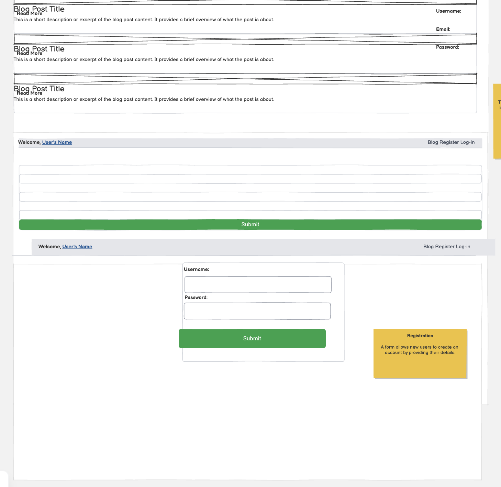
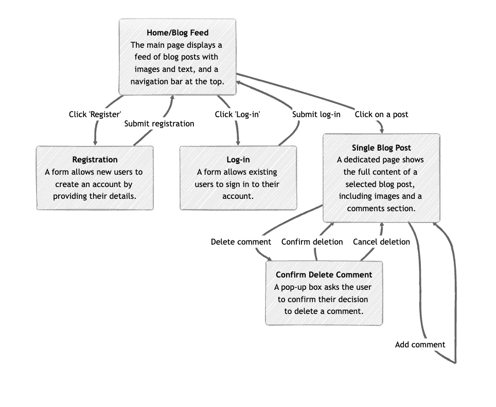
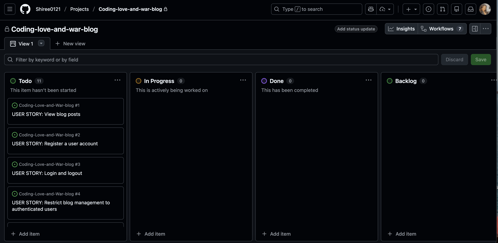
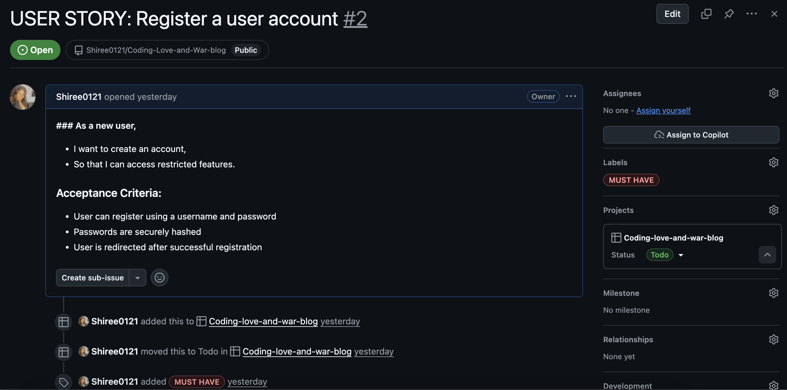
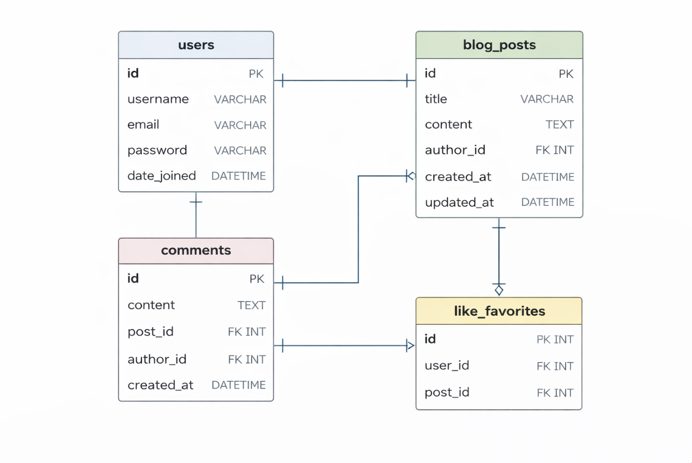

# Coding-Love-and-War-blog

# Introduction 
Coding, Love & War is a full-stack blog application developed using Django as part of the Full-Stack course. The purpose of this project is to demonstrate the practical application of full-stack development principles, including backend logic, database design, and user interaction.

The design focuses on creating an aesthetically pleasing and easy-to-navigate interactive blog. The application allows registured users to register an account, log in, view blog posts, and create comments, with the option to edit or delete their own content. The blog itself documents the struggles of a beginner coder on her journey through learning full-stack development.

The project showcases the steps taken day by day to complete the application within a healthy timeframe, while highlighting the challenges, learning curves, and problem-solving involved throughout the development process.

# Compatability  

# UX design

# Wireframes
My initial intention for this project was to create wireframes using Balsamiq in order to plan the layout and user flow of the application. However, once the free trial expired, this option was no longer available. I then explored alternative ways to visualise my ideas and was given the option to use an AI design tool in Balsamiq.

I chose to use the tool and provided my own prompt, which outlined my original vision for the blog. This included user registration and login functionality, a navigation bar that welcomes the user by name once logged in, blog posts displayed with images, and a comments section where users can add, edit, or delete comments. The design also included a confirmation pop-up to ensure users are aware of their actions and receive feedback when an action has been completed successfully.

The diagram below was generated based on this prompt and was used as a visual reference to guide the structure, layout, and functionality of the application during development.

 

Reflection
Using the Balsamiq AI tool allowed me to visualise my ideas, not necessarily in a perfect form, but as a strong starting point to build from and translate into a working Django application. This approach supported better time management and helped me understand how to prompt AI effectively to produce something meaningful to work with, while ensuring the project remained aligned with my original vision.

# User Stories 

 

The images above showcase the user stories created for Coding, Love & War, which captures the main functionalities and interactions a user can have with the blog. When creating the user stories I used the MoSCoW method to prioritise features by categorising them as Must-have, Should-have, Could-have, and Won’t-have, ensuring that the most essential functionality was implemented first. Ultimately, the user stories focuses on what the user wants to achieve and the benefits they receive. Below are a few examples:

*User Registration & Login*

- Users can register an account and log in to access the blog.

*View Blog Posts*

Users can view all published blog posts to follow the coding journey and read tips.

*Create Comments*

- Registered users can add comments on posts to share thoughts or ask questions.

*Edit/Delete Comments*

- Users can edit or delete their own comments, with confirmation pop-ups to prevent mistakes.

*Responsive & Interactive Design*

- The interface is easy to navigate and visually appealing, working across different devices.

# Entity Relationship Diagram (ERD)

The ERD represents the database structure for **Coding, Love & War** blog.  
The blog is based on the author’s personal experiences, while registered users are able to interact by creating and deleting comments on blog posts.

