# Coding-Love-and-War-blog

# Introduction 
Coding, Love & War is a full-stack blog application developed using Django, Python, HTML and CSS as part of the Full-Stack course. The purpose of this project is to demonstrate the practical application of full-stack development principles, including backend logic, database design, and user interaction.

 The application allows registured users to register an account, log in, view blog posts, and create comments, with the option to edit or delete their own content. The blog itself documents the struggles of a beginner coder on her journey through learning full-stack development.

# Compatability  
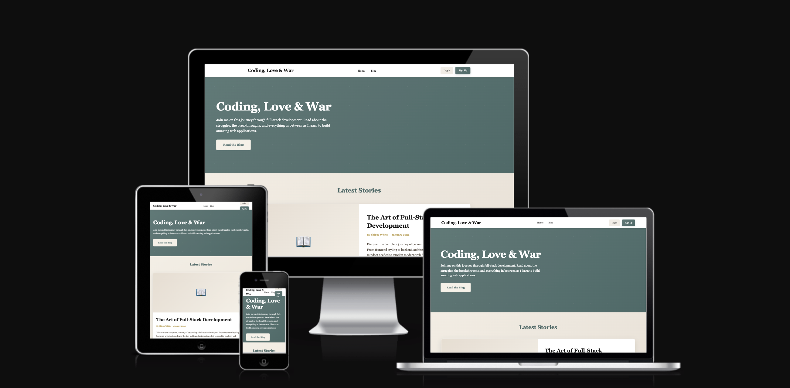
This image was captured using https://fireship.dev/amiresponsive and demonstrates that the website is responsive across a range of devices.
# UX design
The design focuses on creating an aesthetically pleasing and easy-to-navigate interactive blog.

I wanted the design to feel:

Calm and inviting for readers

Warm and personal, reflecting my journey and experiences

Professional but human, so it works for both coding content and personal storytelling

The overall goal is to create a space that feels safe, welcoming, and authentic, not just a technical blog, but a personal one that people actually enjoy spending time on

# Wireframes
My initial intention for this project was to create wireframes using Balsamiq in order to plan the layout and user flow of the application. However, once the free trial expired, this option was no longer available. I then explored alternative ways to visualise my ideas and was given the option to use an AI design tool in Balsamiq.

I chose to use the tool and provided my own prompt, which outlined my original vision for the blog. This included user registration and login functionality, a navigation bar that welcomes the user by name once logged in, blog posts displayed with images, and a comments section where users can add, edit, or delete comments. The design also included a confirmation pop-up to ensure users are aware of their actions and receive feedback when an action has been completed successfully.

The diagram below was generated based on this prompt and was used as a visual reference to guide the structure, layout, and functionality of the application during development.

 

# User Stories 

 

The images above showcase the user stories created for Coding, Love & War, which captures the main functionalities and interactions a user can have with the blog. When creating the user stories I used the MoSCoW method to prioritise features by categorising them as Must-have, Should-have, Could-have, and Won’t-have, ensuring that the most essential functionality was implemented first. Ultimately, the user stories focuses on what the user wants to achieve and the benefits they receive. 

### As a user,
I want to view a list of blog posts,
So that I can read content published on the site.
Acceptance Criteria:
- Blog posts are displayed in chronological order.
- Each post shows title, author, and date.
- Clicking a post opens the full content.

### As a new user,
I want to create an account,
So that I can access restricted features.
Acceptance Criteria:
- User can register using a username and password.
- Passwords are securely hashed.
- User is redirected after successful registration.

### As a registered user,
I want to log in and log out of my account, so that my access is secure.
Acceptance Criteria:
- User can log in with valid credentials.
- User can log out successfully.
- Invalid login shows an error message.

### As a site administrator,
I want only authenticated users to manage blog posts,
So that content remains secure.
Acceptance Criteria:
- Unauthenticated users cannot create, edit, or delete posts.
- Protected views redirect unauthenticated users to login.

### As an authenticated user,
I want to create a blog post, so that I can publish content.
Acceptance Criteria:
- Authenticated users can access post creation form.
- Form validates required fields.
- Post is saved to the database.

### As an authenticated user,
I want to edit an existing comment post made by me, so that I can edit or delete content.
Acceptance Criteria:
- User can edit comments they have permission for
- Changes are saved successfully.
- User is alerted by a pop-up box changes have been updated and can delete.

### As a site admin
I can approve/disapprove comments in order to filter out objectionable comments.
Acceptance Criteria
- Admin can approve a comment.
- Admin can un-approve a comment.

### As a developer,
I want to test authentication features, so that login and permissions work correctly.
Acceptance Criteria:
- Login tests validate correct credentials.
- Unauthorized access is blocked
- Logout works as expected.

### As a developer
I want to track my code changes and deployment process using GitHub and Heroku so that development is organised and the application can be reliably deployed to a live environment.

### As a developer,
I want to create wireframes, an ERD, and architecture diagrams,
so that I can clearly plan the structure, design, and data flow of the Full-Stack web application before development begins.
Also include illistrations to be shown in the blogs.
Acceptance Criteria:
- Wireframes illustrate page layout and user flow.
- ERD shows all models, fields, and relationships.
- Architecture diagram shows major components and deployment setup
All illustrations are stored in the /docs folder in the repository.
- README references all illustrations with file paths.
- Visually simulating for the user experience and easy to use.

### As a registured user
I want to like or favorite posts so that I can show appreciation for content and easily find my favorite posts later.
Acceptance Critieria
Like/Favorite Button:
- Each blog post displays a like/favorite button.
- Users can click the button to like/favorite the post.
Toggle Functionality:
- Clicking the button again removes the like/favorite (toggle feature).
Logged-in Users Only:
- Only registered and logged-in users can like or favorite posts.
- Guests see the button but are prompted to log in if clicked.

# Entity Relationship Diagram (ERD)

The ERD represents the database structure for **Coding, Love & War** blog.  
The blog is based on the author’s personal experiences, while registered users are able to interact by creating and deleting comments on blog posts.

# Site Features 

Coding, Love & War is a personal blog that shares my coding journey while allowing users to interact with posts in a controlled and secure way.

### User Authentication

Users can register, log in, and log out of the site. Only registered users are able to create posts, leave comments, and like or dislike blog posts, which helps keep interactions secure.
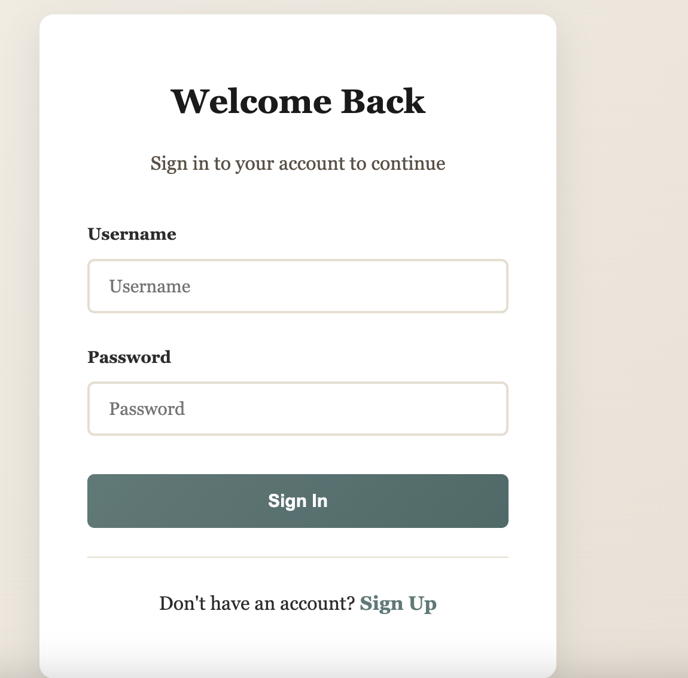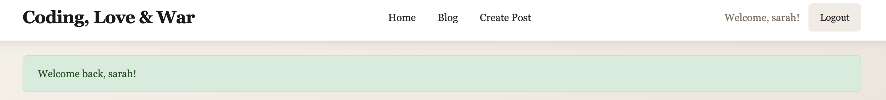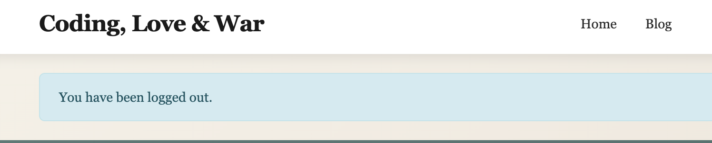

### Blog Post Management

Logged-in users can create blog posts with a title, content, excerpt, featured image, and status (draft or published). Posts can be edited or deleted by their original author, with confirmation required for deletions. Published posts are visible to all visitors, while drafts remain private.
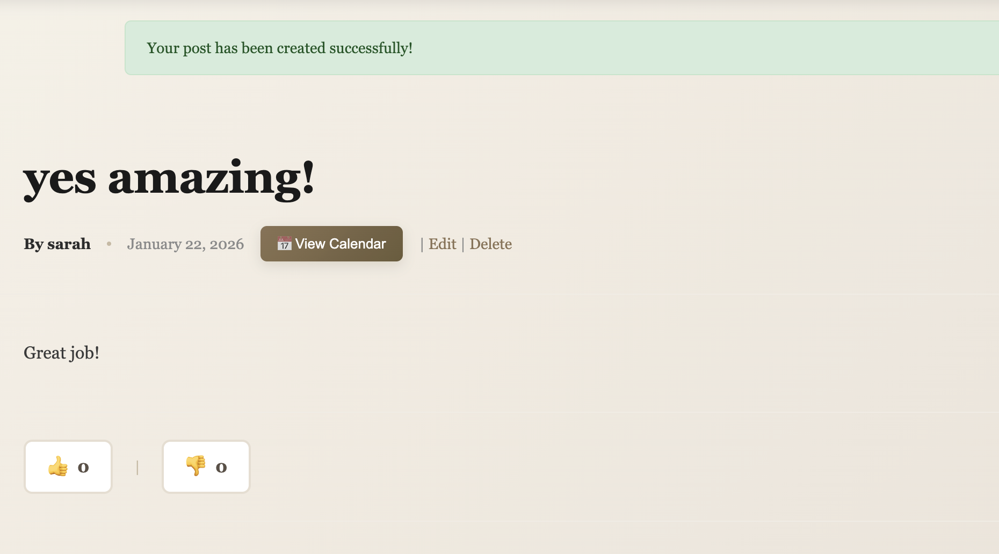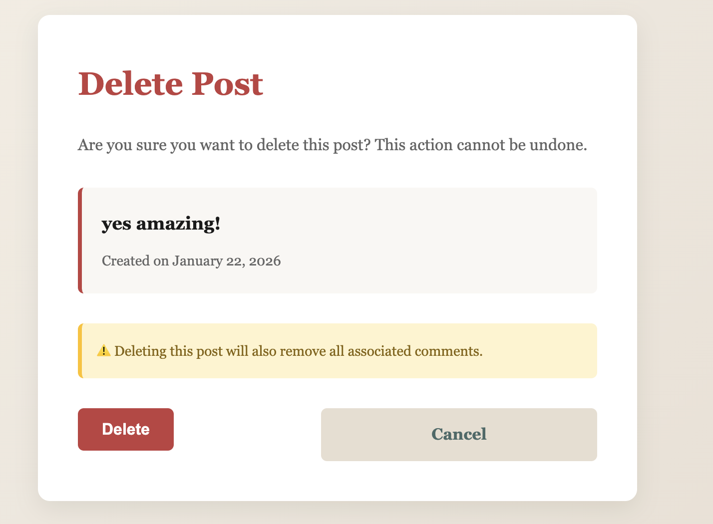

### Post Discovery

The homepage displays the most recent published posts along with short excerpts and a static site description. A blog list page shows all published posts in date order, and each post has its own detail page displaying the full content and comments.
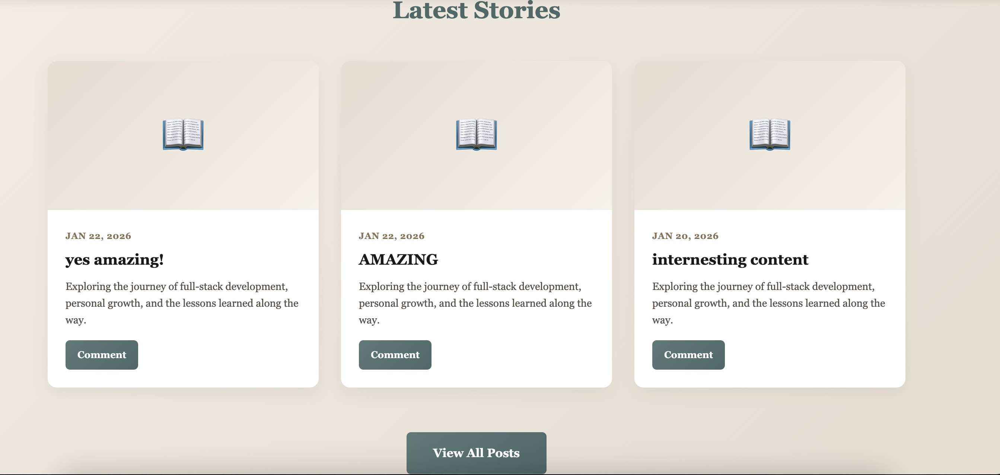

### Commenting System

Registered users can leave comments on blog posts. Comments are not displayed immediately and must be approved by an admin first. Users can edit or delete their own comments, and editing a comment resets its approval status.
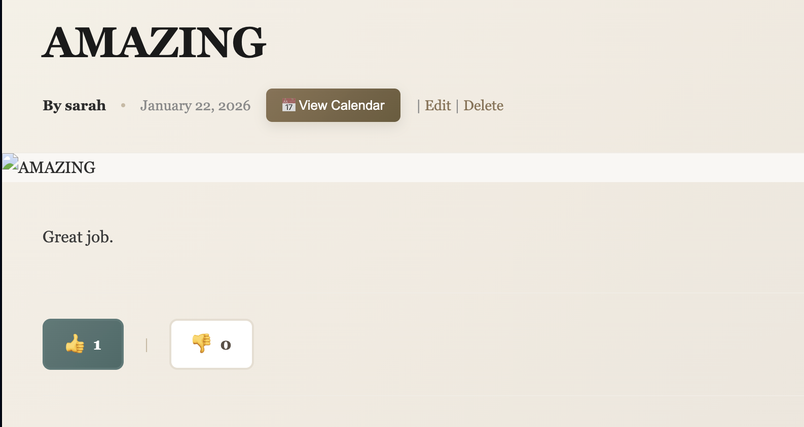

### Post Engagement

Users can like or dislike posts to show engagement. A user can only choose one option at a time, and clicking the same option again removes their vote. Each post displays total likes and dislikes.

### User Permissions

Users are only allowed to edit or delete their own posts and comments. Any unauthorised access attempts are blocked, and comment moderation is handled through an admin approval workflow.

### Navigation

The site includes a clear navigation bar linking to the homepage, blog page, post creation, login/logout, and registration. Clean, readable URLs are generated using post slugs.
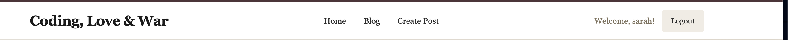

### Content Management

Posts can be saved as drafts or published when ready. Featured images and excerpts improve how content is displayed, and timestamps are automatically recorded for when posts are created and updated.
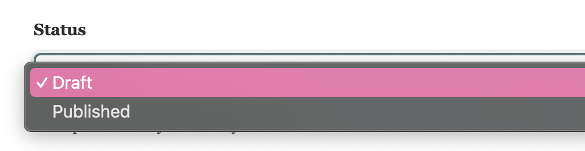

# Testing

Unfortunately, to access the site you must first confirm that you’re happy to proceed, as most browsers currently flag it as a potential phishing site. This is despite me submitting an explanation that the site is safe and is being used for educational purposes only I believe their maybe an issue with the name.

### Manual Testing
The site was tested on the following browsers for compatibility:

### Chrome Testing

| Test                                   | Expected Result | Actual Result |
|----------------------------------------|-----------------|---------------|
| Click Home menu                        | Success         | Success       |
| Click About menu                       | Success         | Success       |
| Click Blogs menu                       | Success         | Success       |
| Click Admin menu                       | Success         | Success       |
| Click Login menu                       | Success         | Success       |
| Click Logout                           | Success         | Success       |
| Click individual blog post             | Success         | Success       |
| Create, edit, delete a personal comment| Success         | Success       |
| Register new account                   | Success         | Success       |
| Create collaboration request           | Success         | Success       |
| Access admin interface                 | Success         | Success       |
| Responsivity                           | Success         | Success       |
| Open new page from social media links  | Success         | Success       |

### Safari Testing
| Test                                   | Expected Result | Actual Result |
|----------------------------------------|-----------------|---------------|
| Click Home menu                        | Success         | Success       |
| Click About menu                       | Success         | Success       |
| Click Blogs menu                       | Success         | Success       |
| Click Admin menu                       | Success         | Success       |
| Click Login menu                       | Success         | Success       |
| Click Logout                           | Success         | Success       |
| Click individual blog post             | Success         | Success       |
| Create, edit, delete a personal comment| Success         | Success       |
| Register new account                   | Success         | Success       |
| Create collaboration request           | Success         | Success       |
| Access admin interface                 | Success         | Success       |
| Responsivity                           | Success         | Success       |
| Open new page from social media links  | Success         | Success       |

### Light house
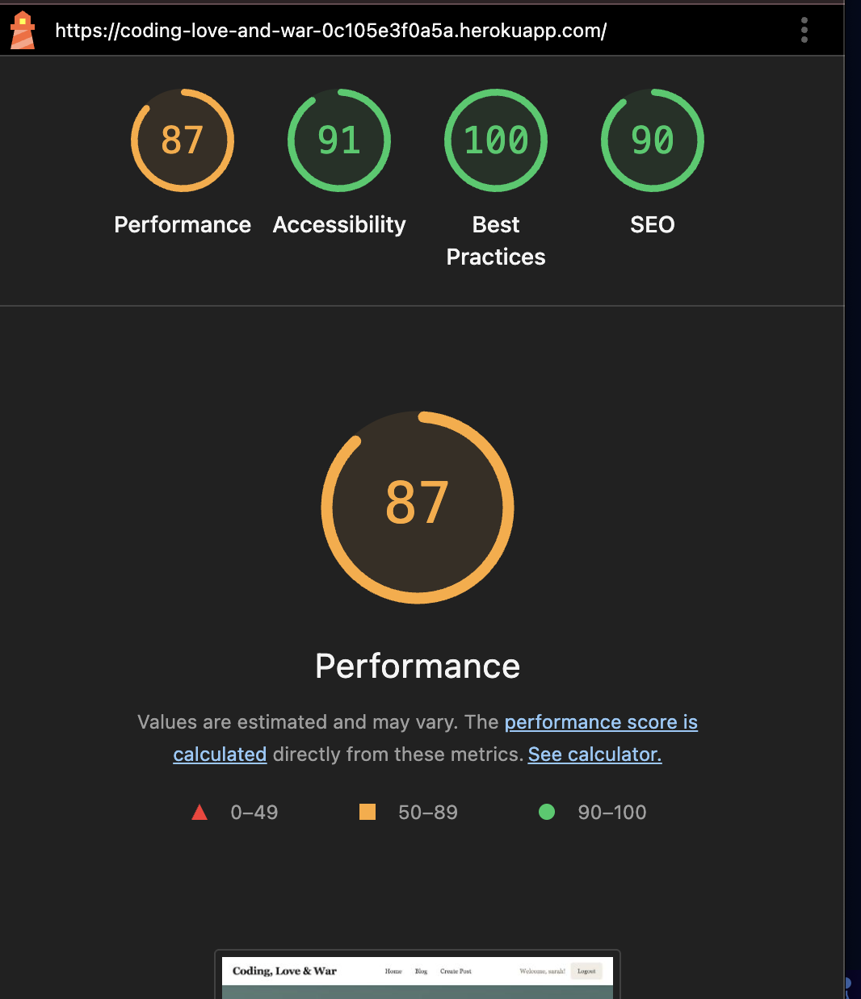 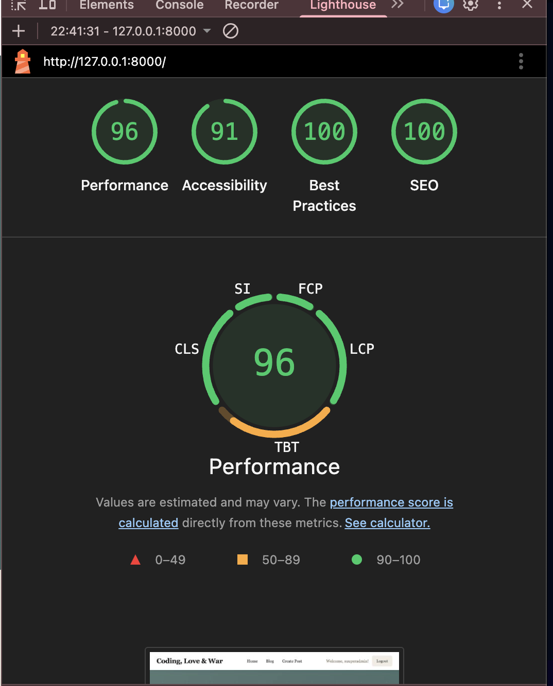 <-local host>
My performance score for the site is 87% on herko, and on local host it is 96%. While there are opportunities for further optimisation, I managed to get the score from initially showing 71% upwards. It was advised to run lighthouse in chrome incognito to 'eliminate extensions affecting results". 

### Responsive Testing
Alongside the built in Bootstrap responsive CSS, Chrome dev tools were used frequently to test the site at standard screen sizes and the site was manually viewed on laptops, tablets and phones.

### Validator Testing

### HTML
The HTML code passes validation with no errors when checked using the official W3C validator.
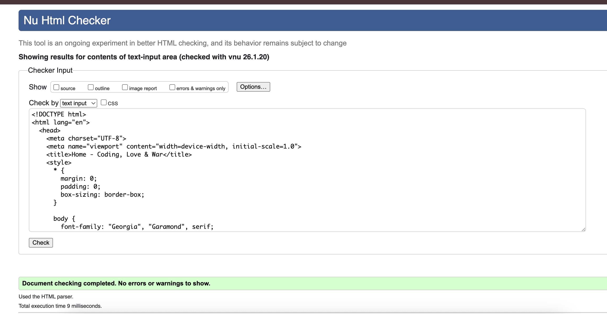

### CSS
No errors were found with our own CSS code when passing through the official Jigsaw validator.
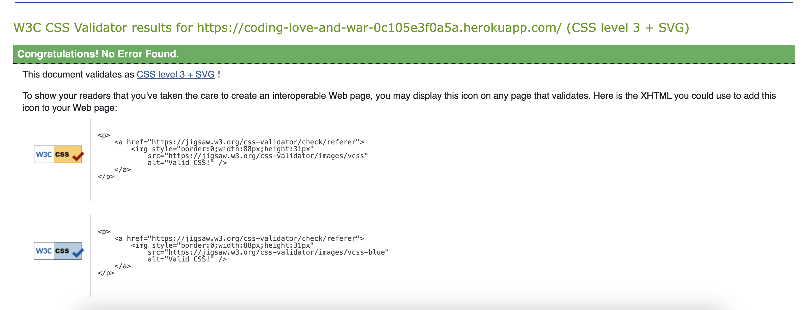

### Python
I checked the busys files which was veiws and they came back with no errors.
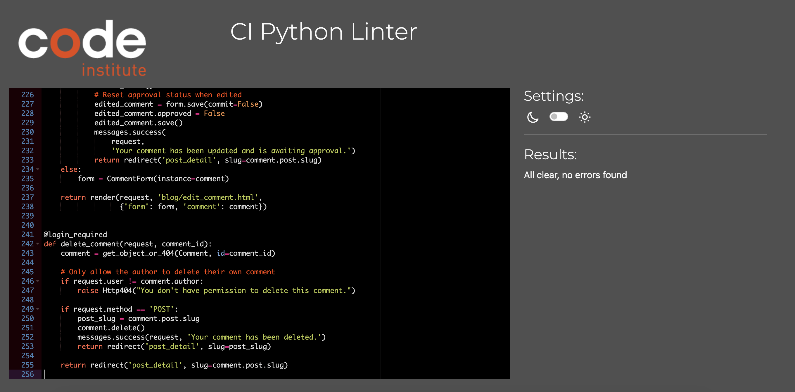

# Deployment

The site was deployed to Heroku from the main branch of the repository early in the development stage for continuous deployment and checking.

The Heroku app is setup with 3 environment variables, repalcing the environment variables stored in env.py (which doesn't get pushed to github).

In order to create an Heroku app:

- Click on New in the Heroku dashboard, and Create new app from the menu dropdown.

- Give your new app a unique name, and choose a region, preferably one that is geographically closest to you.

- Click "Create app"

- In your app settings, click on "Reveal Config Vars" and add the environment variables for your app. These are:

DATABASE_URL - your database connection string
SECRET_Key - the secret key for your app
CLOUDINARY_URL - the cloudinary url for your image store
The PostgreSQL database is served from ElephantSQL

Once the app setup is complete, click on the Deploy tab and:

connect to the required GitHub account
select the repository to deploy from
click the Deploy Branch button to start the deployment.
Once deployment finishes the app can be launched.
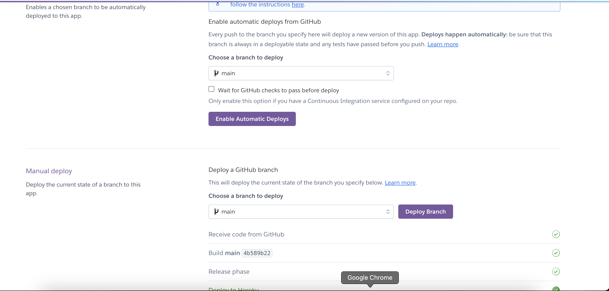

# Reflection
During my coding journey while creating this application, AI has been an great tool for support. It has contributed towards my accuracy and provided instant guidance. Whenever I was uncertain about something, AI helped break it down in a way that was easier to understand, making learning and problem-solving much more efficient.